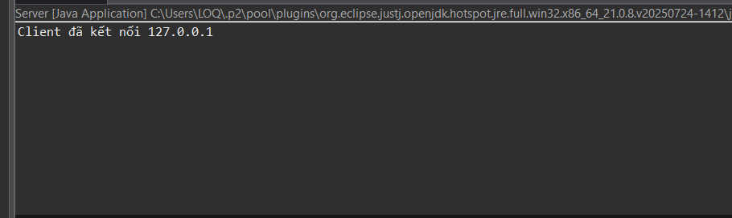
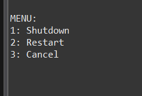
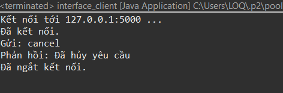
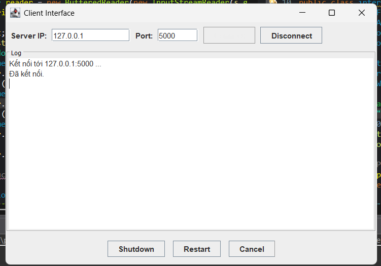
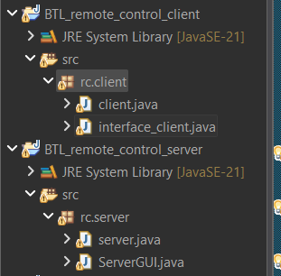
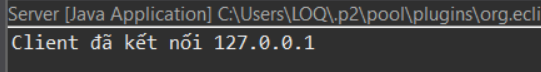
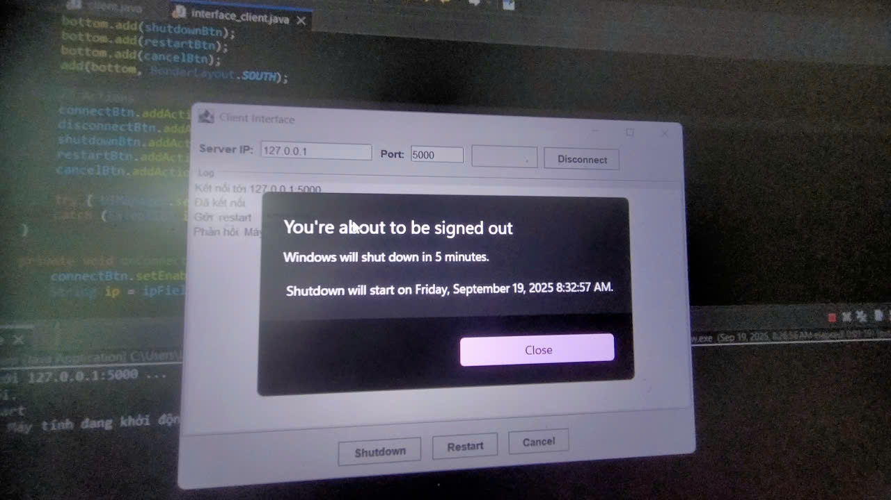
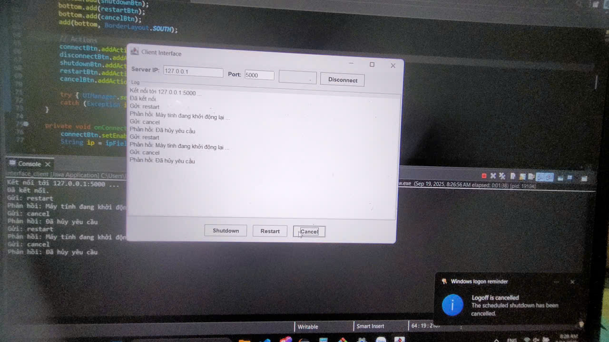

<h2 align="center">
    <a href="https://dainam.edu.vn/vi/khoa-cong-nghe-thong-tin">
    🎓 Faculty of Information Technology (DaiNam University)
    </a>
</h2>
<h2 align="center">
   ỨNG DỤNG ĐIỀU KHIỂN MÁY TÍNH TỪ XA (REMOTE CONTROL)
</h2>
<div align="center">
    <p align="center">
        
        
        
    </p>

[](https://www.facebook.com/DNUAIoTLab)
[](https://dainam.edu.vn/vi/khoa-cong-nghe-thong-tin)
[](https://dainam.edu.vn)

</div>

## 📖 1. Giới thiệu

Ứng dụng điều khiển máy tính từ xa (Remote Control) — phiên bản đơn giản sử dụng **Socket TCP** 
Hệ thống gồm 2 phần chính:

- **Server** (`rc.server.server` — file `server.java`): lắng nghe kết nối trên cổng (mặc định 5000) và xử lý các lệnh từ client.
- **Client**:
  - **Console client** (`rc.client.client` — file `client.java`): giao diện dòng lệnh để gửi lệnh, xem phản hồi.
  - **GUI client** (`rc.client.interface_client` — file `interface_client.java`): giao diện Swing có các nút thao tác (Connect, Disconnect, Shutdown, Restart, Cancel, ...).

**Mục tiêu của project**: cho phép điều khiển một máy tính từ xa qua mạng nội bộ (demo các thao tác đơn giản như gửi lệnh, echo/ping, yêu cầu shutdown/restart — cần cấu hình bảo mật nếu dùng thật).

---

## 🔧 2. Ngôn ngữ lập trình sử dụng

[](https://www.java.com/)

- Project được viết bằng **Java** (JDK 8+ recommended).
- Giao tiếp mạng sử dụng `java.net.Socket` và `java.net.ServerSocket`.
- GUI client sử dụng **Swing** (`javax.swing`).

---

## 🚀 3. Các chức năng, hình ảnh

### Các chức năng chính (tương ứng với code bạn đã upload)
- **Server**
  - Lắng nghe kết nối TCP trên cổng mặc định `5000`.
  - Nhận và phản hồi các lệnh từ client.
   

- **Console Client**
  - Kết nối tới server qua IP và port.
  - Gửi chuỗi lệnh/nhập liệu và nhận phản hồi từ server.
  - Hiển thị phản hồi theo dòng.
  

- **GUI Client (Swing)**
  - Trường nhập IP/Port để kết nối.
  - Nút Connect / Disconnect.
  - Các nút chức năng: Shutdown, Restart, Cancel (tên nút dựa theo file `interface_client.java`).
    
    

  - Vùng log hiển thị trạng thái và phản hồi từ server.
  - Lưu ý: mọi thao tác mạng được khuyến nghị chạy trên thread nền (không block Event Dispatch Thread).


### Hình ảnh minh họa
  - màn hình server (console).
  
  - client console.
  
  
  -  client GUI (interface_client).


  

---

## 🚀 4. Các bước cài đặt

### Yêu cầu
- Java JDK 8 hoặc mới hơn.
- Thiết lập `JAVA_HOME` và thêm `javac`/`java` vào `PATH`.

Kiểm tra:
```bash
java -version
javac -version
```

### Cấu trúc file (ví dụ)



### Chạy Server
```bash
# chạy server (lớp trong package)
java -cp out rc.server.server
```
Server mặc định sẽ lắng nghe cổng **5000** (nếu file server.java dùng port 5000 — kiểm tra trong source).
  

### Chạy Console Client
```bash
java -cp out rc.client.client
```
- Trong client console, chỉnh IP và port nếu cần (mặc định `localhost:5000` trong code).

- Gõ lệnh, nhấn Enter — client gửi lên server; xem phản hồi trên console.


----

### Chạy GUI Client (Swing)
```bash
java -cp out rc.client.interface_client
```
- Giao diện cho phép nhập IP/Port, kết nối, gửi lệnh bằng các nút (Connect / Shutdown / Restart / Cancel).

- Thực hiện các thao tác

- Hủy các thao tác đã thực hiện

- **Lưu ý về UI responsiveness**: code GUI nên chạy kết nối socket trên thread riêng; kiểm tra `interface_client.java` để đảm bảo không block Event Dispatch Thread.

### Thay đổi IP/Port
- Nếu cần kết nối tới máy khác trong mạng, chỉnh giá trị host/port trong `client.java` hoặc nhập trực tiếp trong GUI (nếu GUI có trường nhập).


## 📝 License

Họ tên: Phạm Đình Nghĩa

MSV: 1671020222

Lớp: CNTT 16-01

© 2025 AIoTLab, Faculty of Information Technology, DaiNam University. All rights reserved.

---
